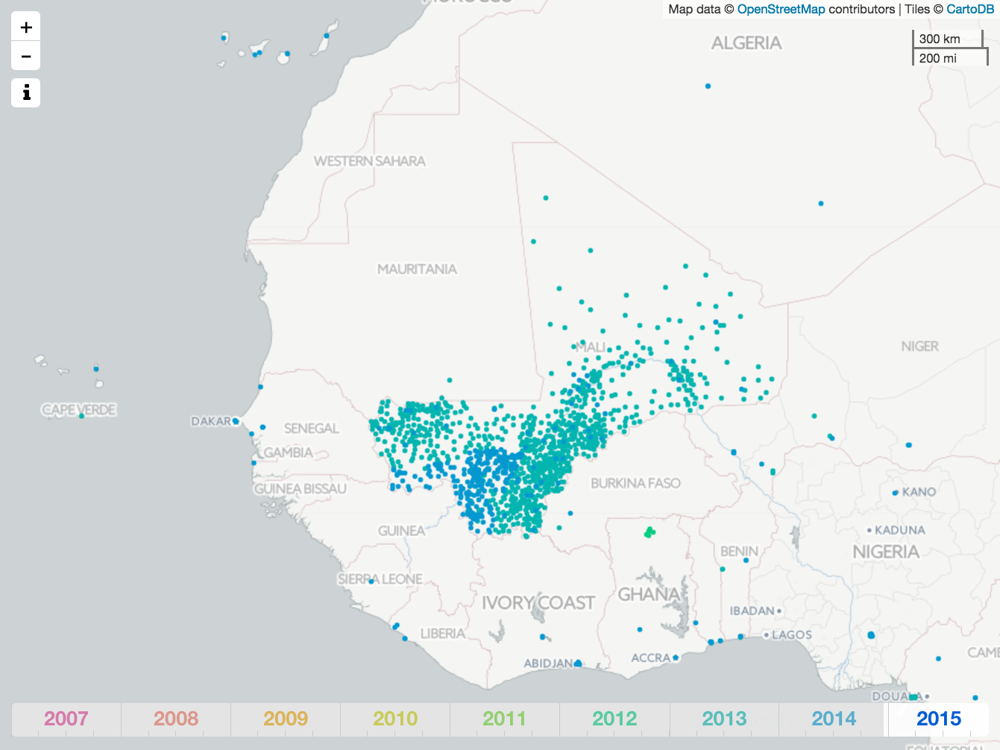
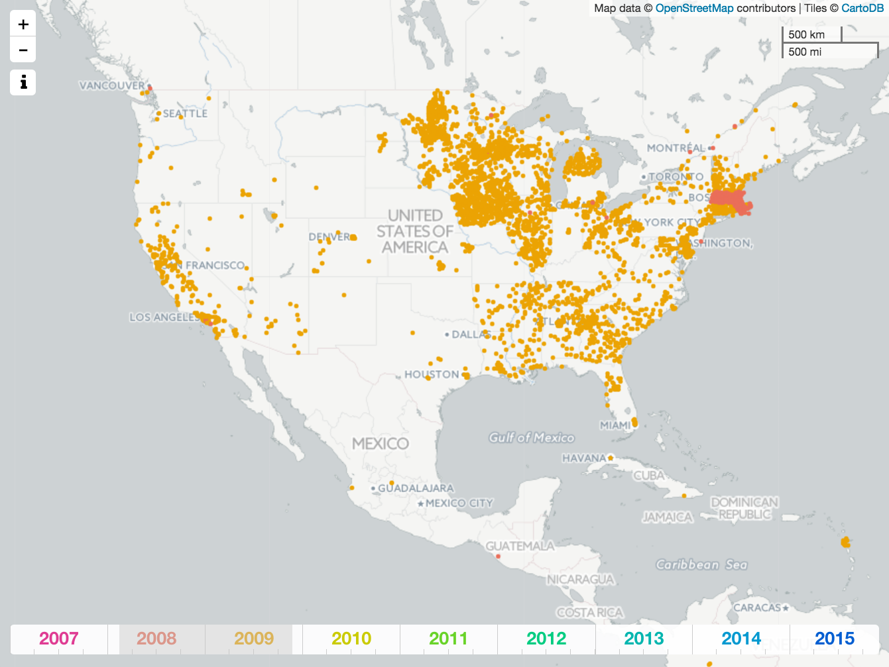
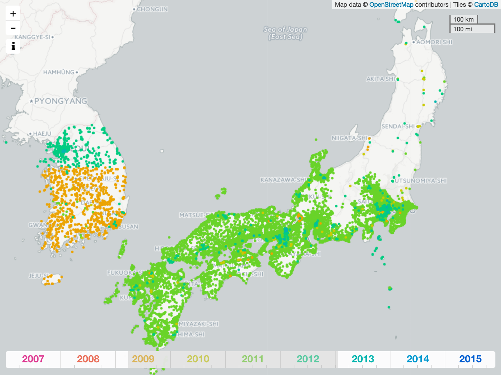

The [OpenStreetMap](http://www.openstreetmap.org/) project started in 2004, and as of 10/2015, the project contains slightly more than 3 billion map elements with approximately 1 million entries added per day, see the [OSM wiki](http://wiki.openstreetmap.org/wiki/Stats). Regarding the coverage of the OpenStreetMap, it is well known that -- at least currently -- it is very uneven, and the level of detail varies significantly from location to location. This can, for example, be seen from the [interactive visualization](http://tyrasd.github.io/osm-node-density/#2/16.5/389.2) of node density by Martin Raifer, see also the blog [entry](http://www.openstreetmap.org/user/tyr_asd/diary/22363). 

Instead of visualizing *all* elements on the latest version of the map, the purpose of `osm-timeslider` (this repo) is to give a way to visualize the *history* of the OSM; `osm-timeslider` makes it possible to selectively view elements that were last edited (or created) during a specific time period. The motivation for doing this is to give a way to better understand how the OpenStreetMap has evolved into its current state. However, to keep the scope of this work somehow under control, `osm-timeslider` will not consider all map elements. Rather, it will restrict to *amenities*, that is, map elements with an `amenity=..`-tag. These are one of the most frequently used tags on the OSM. Further, the visualizations are restricted to those amenities with c. 20k - 100k elements on the current map. General information about amenities and their use on the OpenStreetMap is collected on the [OSM wiki](http://wiki.openstreetmap.org/wiki/Key:amenity). Statistics about the most popular tags (including amenity tags) can be found on the [taginfo webpage](https://taginfo.openstreetmap.org/keys/amenity#values). 

`osm-timeslider` is browser-based and written using the [Leaflet library](http://leafletjs.com/). A more detailed description of how the amenity map elements are extracted is given in the [README](./data/README.md) file in the `data` directory. In summary, data is extracted from the latest snapshot (as of 10/2015), and each map element is represented by its latest timestamp. To be clear, the visualizations do not represent the full edit history of the OpenStreetMap project. 

The below screenshots show examples of `osm-timeslider` in use. The first screenshot shows clinics in a region around Mali. Each clinic element (that is, each map element with an `amenity=clinic` tag) is shown as a colored dot with the color indicating when the element was last edited (or created). For example, the teal colored dots represent map elements with a timestamp from 2013. Moreover, the slider on the bottom of the screen can be used to change the selected time period. In the clinic screenshot, the slider is set to display clinics from 2007 to the beginning of 2015. Clicking on a marker also displays further information about the map element.

The below list shows those amenities with c. 20k - 100k elements in the current snapshot of the [OpenStreetMap](https://openstreetmap.org) (as of 10/2015). This list contains 27 amenity types, and for each amenity, the `visualization`-link opens the interactive visualization. Please note that the visualizations can take some time to load.

|amenity|count|visualization|taginfo link|OSM wiki|
|:----|----:|----:|----:|----:|
|drinking_water| 102k|[link](https://matiasdahl.github.io/osm-timeslider/index.html?amenity=drinking_water)|[link](https://taginfo.openstreetmap.org/tags/amenity=drinking_water)|[link](https://wiki.openstreetmap.org/wiki/Tag:amenity%3Ddrinking_water)|
|telephone| 92k|[link](https://matiasdahl.github.io/osm-timeslider/index.html?amenity=telephone)|[link](https://taginfo.openstreetmap.org/tags/amenity=telephone)|[link](https://wiki.openstreetmap.org/wiki/Tag:amenity%3Dtelephone)|
|atm| 89k|[link](https://matiasdahl.github.io/osm-timeslider/index.html?amenity=atm)|[link](https://taginfo.openstreetmap.org/tags/amenity=atm)|[link](https://wiki.openstreetmap.org/wiki/Tag:amenity%3Datm)|
|bar| 84k|[link](https://matiasdahl.github.io/osm-timeslider/index.html?amenity=bar)|[link](https://taginfo.openstreetmap.org/tags/amenity=bar)|[link](https://wiki.openstreetmap.org/wiki/Tag:amenity%3Dbar)|
|police| 78k|[link](https://matiasdahl.github.io/osm-timeslider/index.html?amenity=police)|[link](https://taginfo.openstreetmap.org/tags/amenity=police)|[link](https://wiki.openstreetmap.org/wiki/Tag:amenity%3Dpolice)|
|fire_station| 78k|[link](https://matiasdahl.github.io/osm-timeslider/index.html?amenity=fire_station)|[link](https://taginfo.openstreetmap.org/tags/amenity=fire_station)|[link](https://wiki.openstreetmap.org/wiki/Tag:amenity%3Dfire_station)|
|townhall| 72k|[link](https://matiasdahl.github.io/osm-timeslider/index.html?amenity=townhall)|[link](https://taginfo.openstreetmap.org/tags/amenity=townhall)|[link](https://wiki.openstreetmap.org/wiki/Tag:amenity%3Dtownhall)|
|parking_space| 71k|[link](https://matiasdahl.github.io/osm-timeslider/index.html?amenity=parking_space)|[link](https://taginfo.openstreetmap.org/tags/amenity=parking_space)|[link](https://wiki.openstreetmap.org/wiki/Tag:amenity%3Dparking_space)|
|hunting_stand| 70k|[link](https://matiasdahl.github.io/osm-timeslider/index.html?amenity=hunting_stand)|[link](https://taginfo.openstreetmap.org/tags/amenity=hunting_stand)|[link](https://wiki.openstreetmap.org/wiki/Tag:amenity%3Dhunting_stand)|
|vending_machine| 64k|[link](https://matiasdahl.github.io/osm-timeslider/index.html?amenity=vending_machine)|[link](https://taginfo.openstreetmap.org/tags/amenity=vending_machine)|[link](https://wiki.openstreetmap.org/wiki/Tag:amenity%3Dvending_machine)|
|fountain| 57k|[link](https://matiasdahl.github.io/osm-timeslider/index.html?amenity=fountain)|[link](https://taginfo.openstreetmap.org/tags/amenity=fountain)|[link](https://wiki.openstreetmap.org/wiki/Tag:amenity%3Dfountain)|
|library| 53k|[link](https://matiasdahl.github.io/osm-timeslider/index.html?amenity=library)|[link](https://taginfo.openstreetmap.org/tags/amenity=library)|[link](https://wiki.openstreetmap.org/wiki/Tag:amenity%3Dlibrary)|
|doctors| 49k|[link](https://matiasdahl.github.io/osm-timeslider/index.html?amenity=doctors)|[link](https://taginfo.openstreetmap.org/tags/amenity=doctors)|[link](https://wiki.openstreetmap.org/wiki/Tag:amenity%3Ddoctors)|
|swimming_pool| 47k|[link](https://matiasdahl.github.io/osm-timeslider/index.html?amenity=swimming_pool)|[link](https://taginfo.openstreetmap.org/tags/amenity=swimming_pool)|[link](https://wiki.openstreetmap.org/wiki/Tag:amenity%3Dswimming_pool)|
|social_facility| 39k|[link](https://matiasdahl.github.io/osm-timeslider/index.html?amenity=social_facility)|[link](https://taginfo.openstreetmap.org/tags/amenity=social_facility)|[link](https://wiki.openstreetmap.org/wiki/Tag:amenity%3Dsocial_facility)|
|university| 38k|[link](https://matiasdahl.github.io/osm-timeslider/index.html?amenity=university)|[link](https://taginfo.openstreetmap.org/tags/amenity=university)|[link](https://wiki.openstreetmap.org/wiki/Tag:amenity%3Duniversity)|
|car_wash| 36k|[link](https://matiasdahl.github.io/osm-timeslider/index.html?amenity=car_wash)|[link](https://taginfo.openstreetmap.org/tags/amenity=car_wash)|[link](https://wiki.openstreetmap.org/wiki/Tag:amenity%3Dcar_wash)|
|college| 32k|[link](https://matiasdahl.github.io/osm-timeslider/index.html?amenity=college)|[link](https://taginfo.openstreetmap.org/tags/amenity=college)|[link](https://wiki.openstreetmap.org/wiki/Tag:amenity%3Dcollege)|
|bus_station| 30k|[link](https://matiasdahl.github.io/osm-timeslider/index.html?amenity=bus_station)|[link](https://taginfo.openstreetmap.org/tags/amenity=bus_station)|[link](https://wiki.openstreetmap.org/wiki/Tag:amenity%3Dbus_station)|
|community_centre| 29k|[link](https://matiasdahl.github.io/osm-timeslider/index.html?amenity=community_centre)|[link](https://taginfo.openstreetmap.org/tags/amenity=community_centre)|[link](https://wiki.openstreetmap.org/wiki/Tag:amenity%3Dcommunity_centre)|
|marketplace| 29k|[link](https://matiasdahl.github.io/osm-timeslider/index.html?amenity=marketplace)|[link](https://taginfo.openstreetmap.org/tags/amenity=marketplace)|[link](https://wiki.openstreetmap.org/wiki/Tag:amenity%3Dmarketplace)|
|dentist| 29k|[link](https://matiasdahl.github.io/osm-timeslider/index.html?amenity=dentist)|[link](https://taginfo.openstreetmap.org/tags/amenity=dentist)|[link](https://wiki.openstreetmap.org/wiki/Tag:amenity%3Ddentist)|
|waste_disposal| 28k|[link](https://matiasdahl.github.io/osm-timeslider/index.html?amenity=waste_disposal)|[link](https://taginfo.openstreetmap.org/tags/amenity=waste_disposal)|[link](https://wiki.openstreetmap.org/wiki/Tag:amenity%3Dwaste_disposal)|
|theatre| 21k|[link](https://matiasdahl.github.io/osm-timeslider/index.html?amenity=theatre)|[link](https://taginfo.openstreetmap.org/tags/amenity=theatre)|[link](https://wiki.openstreetmap.org/wiki/Tag:amenity%3Dtheatre)|
|taxi| 21k|[link](https://matiasdahl.github.io/osm-timeslider/index.html?amenity=taxi)|[link](https://taginfo.openstreetmap.org/tags/amenity=taxi)|[link](https://wiki.openstreetmap.org/wiki/Tag:amenity%3Dtaxi)|
|clinic| 20k|[link](https://matiasdahl.github.io/osm-timeslider/index.html?amenity=clinic)|[link](https://taginfo.openstreetmap.org/tags/amenity=clinic)|[link](https://wiki.openstreetmap.org/wiki/Tag:amenity%3Dclinic)|
|parking_entrance| 19k|[link](https://matiasdahl.github.io/osm-timeslider/index.html?amenity=parking_entrance)|[link](https://taginfo.openstreetmap.org/tags/amenity=parking_entrance)|[link](https://wiki.openstreetmap.org/wiki/Tag:amenity%3Dparking_entrance)|

## Screenshots

### Clinics in Mali

[open visualization](https://matiasdahl.github.io/osm-timeslider/index.html?amenity=clinic)

### Townhalls in the USA

[open visualization](https://matiasdahl.github.io/osm-timeslider/index.html?amenity=townhall)

The Geographic Names Information System (GNIS) is a database of millions of geographic features in the USA. This was imported into the OSM in 2009, see the [OSM wiki](http://wiki.openstreetmap.org/wiki/USGS_GNIS). In the United States, these database imports can be seen for many of the amenities listed above. These kinds of large database imports can be seen as large point clouds suddenly appearing (or disappearing) when moving the slider. The orange dots in the above screenshot show townhall amenities with a timestamp from 2009. The red dots are townhalls in Boston with a timestamp from 2008, see changeset [143731](http://www.openstreetmap.org/changeset/143731).

When the time range is expanded (by moving the slider at the bottom of the screen), new markers are drawn on top of old ones. When the map is zoomed out (as in the above screenshot), this means that the same time range can produce different images depending on how the time range was selected. Above, for example, the red region (showing edits from 2008) is seen when the time period is expanded backwards in time from 2009 to 2008. However, if the same range is selected by going forward in time, there are enough edits in Boston with timestamps from 2009 to almost cover the edits from 2008. Of course, if one zooms in on the map, one can see all the markers from both 2008 and 2009.

### Police stations in Japan/South Korea

[open visualization](https://matiasdahl.github.io/osm-timeslider/index.html?amenity=police)

South Korea divides into two regions. The orange dots (in the south) represent police stations with a timestamp from 2009. The teal dots (in the north) represent police stations with a timestamp from 2012. Similarly, the green dots (in the south of Japan) represent police stations with a timestamp from 2011. 

### Notes

- The restriction to amenities with c. 20k - 100k elements is a matter of performance. In this range, the top amenity is `drinking_water`, with c. 102k elements. On a modern laptop, Leaflet (v. 1.0.0-beta.2) can run the visualization, but the UI is slow and starts to lag with such many markers. The most popular amenity tag (`amenity=parking`) has close to 2 million map elements, see [taginfo](https://taginfo.openstreetmap.org/tags/amenity=parking).
- The slider at the bottom of the screenshots range from 2007-2015. However, many of the amenities also contain elements with timestamps before this period, and these are not displayed.

### License 

The code for the `osm-timeslider` visualization is open source, see the [LICENSE](LICENSE.md) file.

The above table and images are generated using data from the [OpenStreetMap](https:/openstreetmap.org) project. This OSM data is © OpenStreetMap contributors, and it is available under the terms of the [ODbL](https://www.openstreetmap.org/copyright). For further details about the amenity data shown in the visualizations, please see the [README](./data/README.md) file in the `data` directory. Maps are drawn using the open source [Leaflet library](http://leafletjs.com/) using the [Positron tiles](https://cartodb.com/basemaps) (tiles © CartoDB, CC BY 3.0). In addition, the `osm-timeslider` visualization makes use the open source libraries: [jQRangeSlider](https://github.com/ghusse/jQRangeSlider), [SpinKit](https://github.com/tobiasahlin/SpinKit), [jQuery](https://jquery.com/) and [jquery-modal](https://github.com/kylefox/jquery-modal), see the [LICENSE](LICENSE.md) file.
